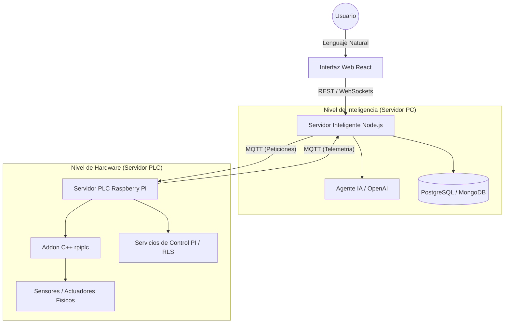

# Información del Proyecto - LLMControl V3

### 🛠️ Detalles Generales
*   **Versión actual**: V3 (3.0.0)
*   **Repositorio**: [https://github.com/frealpe/Natural-Language-Industrial-Control](https://github.com/frealpe/Natural-Language-Industrial-Control)
*   **Licencia**: MIT
*   **Sistema de Versiones**: Git

### 💻 Stack Tecnológico
*   **Lenguajes**: JavaScript (Node.js, React), C++ (Addons), HTML5, CSS3, SQL.
*   **Frontend**: React (Vite + CoreUI Pro), Vega-Lite, Redux, Zustand, Socket.io-client.
*   **Backend**: Node.js, Express, Socket.io, Mongoose (MongoDB), pg (PostgreSQL).
*   **Industria/Hardware**: Raspberry Pi (Industrial Shields RPIPLC), MQTT (Mosquitto), OPC UA.
*   **IA**: OpenAI API, Local LLMs (Ollama/DeepSeek).

### ⚙️ Requisitos de Entorno y Compilación
*   **Entorno**: Node.js 16+, G++/GCC & Make (para Addons de C++).
*   **Bases de Datos**: MongoDB, PostgreSQL (activas).
*   **Broker**: Mosquitto MQTT (Puerto 1883).
*   **Sistema Operativo (PLC)**: Raspberry Pi OS (Linux).
*   **Visualización**: Navegador Web (Chrome/Firefox/Edge).

### 📧 Soporte
*   **Contacto**: fabio.realpe@unicauca.edu.co

---

---

## 📄 Descripción del Software
**LLMControl** es una plataforma de software integral diseñada para automatizar el ciclo de vida del control industrial mediante la convergencia de la **Inteligencia Artificial Generativa** y el control automático tradicional. El software permite pasar de una descripción en lenguaje natural a un sistema físico controlado y optimizado, eliminando la necesidad de sintonización manual experta por parte del operador.

## 🏗️ Arquitectura del Software
La arquitectura de **LLMControl** sigue un modelo de **Agentes de Control Distribuidos** estructurado en tres niveles de abstracción:



**Detalles de Implementación:**
*   **Servidor PLC:** Ejecuta tareas de tiempo real crítico (muestreo ADC, PWM) y algoritmos de identificación (RLS) en el nodo Raspberry Pi. Desarrollado en Node.js con extensiones nativas en C++.
*   **Servidor PC:** Maneja la lógica de negocio pesada, la persistencia histórica en PostgreSQL/MongoDB y la orquestación con los modelos LLM (GPT-4o).
*   **Interfaz de Usuario:** Construida en React, permite la visualización de datos mediante Vega-Lite y la interacción mediante lenguaje natural.

## ⚙️ Tecnologías y Algoritmos Utilizados

### 1. Modelado de Procesos
Se emplean **Redes de Petri** para el control lógico secuencial y concurrente, garantizando seguridad operativa y coherencia en la ejecución de acciones.

### 2. Análisis de Datos
El procesamiento de datos experimentales se realiza mediante herramientas de análisis estadístico y regresión implementadas con bibliotecas como **Danfo.js** y **Simple-Statistics**.

### 3. Protocolos de Comunicación
La interoperabilidad se logra mediante protocolos industriales estándar como **OPC UA y MQTT**, fundamentales en entornos IoT industriales.

### 4. Visualización
La representación gráfica de estados y predicciones se realiza mediante la gramática declarativa **Vega-Lite**.

## 🔄 Automatización del Ciclo de Control Industrial
LLMControl automatiza las cuatro fases críticas del diseño de control (caracterización, identificación, simulación y control) mediante agentes inteligentes.

### 1. Caracterización Automática
El sistema inicializa automáticamente el hardware, valida conexiones y ajusta parámetros de adquisición sin intervención manual.

### 2. Identificación Adaptativa
Los datos experimentales se almacenan estructuradamente, permitiendo la selección automática del modelo dinámico más representativo del sistema.

### 3. Simulación y Control Autónomo
El agente genera y valida modelos de control **PI** mediante simulaciones internas antes de su implementación en el sistema físico, eliminando ciclos manuales de prueba y error.

## ⚙️ Funcionalidades Principales
1.  **Interpretación Semántica:** Traduce objetivos operativos complejos en parámetros de control y lógica secuencial.
2.  **Identificación Automática de Sistemas:** Algoritmos (como RLS y Batch Least Squares) que determinan el modelo matemático (ARX) de una planta física.
3.  **Control PI Adaptativo:** Implementación de controladores proporcionales-integrales con anti-windup escalados para hardware industrial.
4.  **Simulación Digital Twin:** Generación de modelos en JavaScript que permiten predecir el comportamiento del hardware antes de la ejecución física.
5.  **Monitoreo en Tiempo Real:** Visualización de telemetría industrial (ADC, PWM, Errores) con latencia mínima.

## 🚀 Impacto y Aplicaciones
LLMControl representa un nuevo paradigma en automatización industrial: el **Control Cognitivo Autónomo**.

**Aplicaciones potenciales:**
*   Sistemas de manufactura inteligente y procesos industriales auto-configurables.
*   Laboratorios remotos de control y plataformas educativas de automatización.

## 💻 Análisis de Fragmentos de Código

### A. Selección de Modelos por IA (`gtpServicesIndentificacion.js`)
El sistema utiliza GPT-4o para analizar la estabilidad de modelos matemáticos:
```javascript
// La IA selecciona el MEJOR modelo considerando estabilidad (polos) y parsimonia (orden).
const prompt = `Analiza los modelos candidatos... Selecciona el MEJOR considerando el compromiso entre simplicidad (Orden) y precisión (Error).`;
```

### B. Algoritmo de Control PI Discreto (`plcServices.js`)
Implementación de la ley de control con anti-windup sobre hardware real:
```javascript
function piController(error) {
  let u = Kp * (error + (integralError / Ti));
  if (u > 8.8) u = 8.8; // Saturación física (8.8V)
  if (u < 0.0) u = 0.0;
  if (u > 0.0 && u < 8.8) integralError += Ts * error; // Anti-windup
  return u;
}
```

---

## 🔬 Resumen Científico

### 1. Importancia y Problemas Científicos Solucionados
**LLMControl** es fundamental porque democratiza la automatización industrial avanzada, permitiendo que operadores sin conocimientos profundos en lenguajes de programación de bajo nivel interactúen con sistemas físicos complejos mediante lenguaje natural.

**Problemas Científicos Resueltos:**
*   **Interacción Humano-Máquina (HMI) Cognitiva:** Resuelve el desafío de mapear instrucciones semánticas ambiguas hacia comandos de control precisos y deterministas.
*   **Síntesis Automática de Control:** Automatiza la transición entre requisitos operativos y la implementación física de leyes de control ajustadas algorítmicamente.
*   **Seguridad en Sistemas Concurrentes:** Garantiza la coherencia operativa mediante el uso de **Redes de Petri** para validar la lógica propuesta por la IA antes de su ejecución.

### 2. Contribución al Proceso de Descubrimiento Científico
El software contribuye al avance de la **Industria 5.0**, facilitando la investigación en sistemas industriales "auto-conscientes" que pueden caracterizar su propio hardware e identificar sus dinámicas internas de forma autónoma. 

*   **Línea de Investigación:** Integración de Modelos de Lenguaje de Gran Escala (LLM) con control de procesos basado en estados y eventos concurrentes.
*   **Institución vinculada:** Departamento de Electrónica, Instrumentación y Control de la **Universidad del Cauca**.

### 3. Configuración del Entorno Experimental
El entorno experimental típico consiste en un PLC industrial basado en **Raspberry Pi** conectado a sensores y actuadores físicos (ej. sistemas de nivel, presión o temperatura).

**Flujo de Uso para el Investigador/Usuario:**
1.  **Entrada Semántica:** El usuario solicita un objetivo de control en lenguaje natural a través de la interfaz web.
2.  **Orquestación Inteligente:** El servidor de IA analiza datos históricos y realiza el ciclo de Caracterización -> Identificación -> Simulación.
3.  **Ejecución Física:** El sistema genera un controlador (PI u otro) y envía las señales de control vía **MQTT** al hardware, cerrando el lazo de control en tiempo real.
4.  **Monitoreo:** Los resultados se visualizan dinámicamente mediante **Vega-Lite**, permitiendo validar la hipótesis de control planteada.
